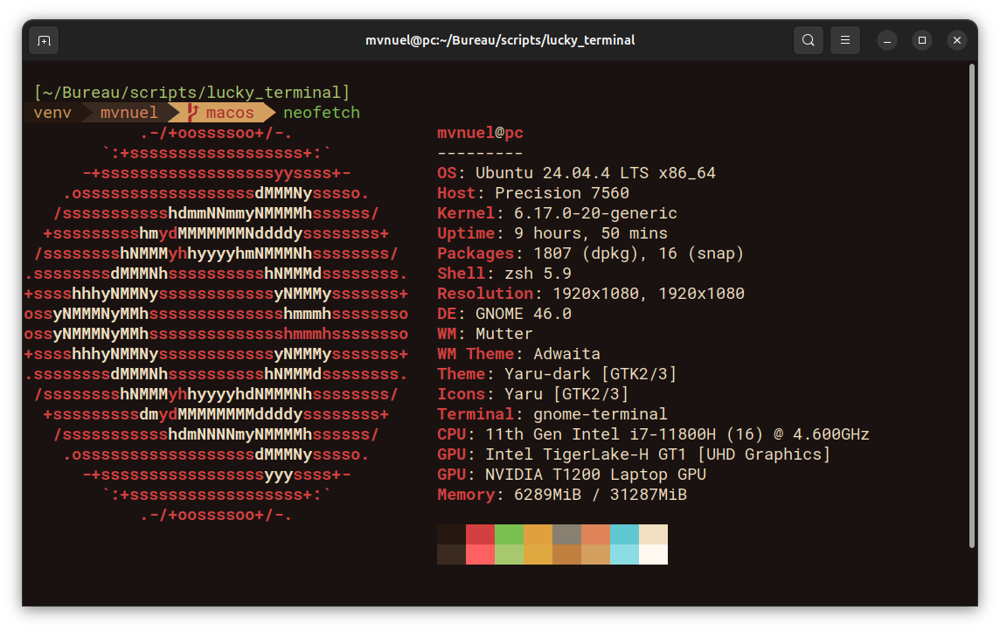

# Lucky Terminal



Ce projet est un fork **inspiré du dépôt [pixegami/terminal-profile](https://github.com/pixegami/terminal-profile)** (scripts d’installation en trois étapes, Oh My Zsh, thème Agnoster dérivé, profil GNOME Terminal). La base conceptuelle et la structure reprennent cette approche ; les couleurs, le nom du thème, `dircolors`, la démo HTML et le script de désinstallation sont des **extensions et personnalisations** propres à ce dépôt **Mvnuel**.

Configuration **Zsh + Oh My Zsh** pour **Ubuntu / Linux** (GNOME Terminal) ou **macOS** (script dédié + iTerm2), avec une **palette personnalisée** et un thème Agnoster dérivé.

Les scripts d’origine (côté Pixegami) ont été testés sur Ubuntu 20 ; ce dépôt a depuis été **enrichi** (palette Mvnuel, `dircolors`, démo web, script de désinstallation).

### Quelle procédure suivre ?

| Système | Où aller |
|--------|----------|
| **macOS** | **Uniquement le dossier [`macos/`](macos/README.md)** : **Ne pas** lancer les scripts à la racine (ils ciblent Ubuntu/`apt`/`dconf`). |
| **Linux (Ubuntu, etc.)** | Scripts à la racine du dépôt (section **Installation (Linux / Ubuntu)** ci-dessous) et dossier `configs/`. |

## Contenu du dépôt (principaux fichiers)

| Élément | Rôle |
|--------|------|
| `install.sh` | **Tout-en-un Linux** : enchaîne `install_powerline.sh` → `install_terminal.sh` → `install_profile.sh` |
| `install_powerline.sh` | Polices Powerline, Vim, `pipx` + `powerline-status` |
| `install_terminal.sh` | Zsh, Oh My Zsh |
| `install_profile.sh` | Extensions Zsh, `~/.zshrc`, `~/.dircolors`, thème `mvnuel-agnoster`, profil GNOME Terminal, `chsh` → zsh |
| `uninstall.sh` | Retour bash, retrait du profil Mvnuel, Oh My Zsh, Powerline (pipx), etc. |
| `purge_zsh.sh` | **Nettoyage résiduel** : supprime `~/.oh-my-zsh`, `~/.zshrc`, caches zsh, etc. (après désinstall incomplète ou avant réinstall) |
| `configs/terminal_profile.dconf` | Couleurs + police du terminal GNOME |
| `configs/mvnuel-agnoster.zsh-theme` | Prompt Powerline (couleurs hex) |
| `configs/dircolors` | Couleurs de `ls` (GNU `dircolors`) |
| **`macos/`** | **macOS** : `install.sh` (import auto du profil **`mvnuel.terminal`** dans Terminal.app), `uninstall.sh`, `purge_zsh.sh`, `Mvnuel.itermcolors` (iTerm2), configs **`macos/configs/`** — [README macOS](macos/README.md) |

# macOS

**Point d’entrée unique pour les utilisateurs macOS : le dossier [`macos/`](macos/README.md).**  
Pas d’`apt` ni de `dconf` : installation via **Homebrew** et fichiers dans **`macos/configs/`**. **iTerm2** : import **`macos/Mvnuel.itermcolors`**. **Terminal.app** : **`install.sh`** enregistre **`macos/mvnuel.terminal`** comme profil par défaut (détails : [macos/README.md](macos/README.md)).

```bash
chmod +x macos/install.sh
./macos/install.sh
```

Désinstallation / nettoyage zsh côté macOS : **`./macos/uninstall.sh`** puis au besoin **`./macos/purge_zsh.sh`** (détails et options dans **[macos/README.md](macos/README.md)**).  
La section **Désinstallation** ci-dessous décrit les scripts **`./uninstall.sh`** et **`./purge_zsh.sh`** à la racine (**Linux** uniquement).

# Prérequis (Linux / Ubuntu)

```bash
# Mise à jour des paquets système
sudo apt-get update
sudo apt-get upgrade

# Installation de Git et Vim
sudo apt-get install -y git vim
```

# Installation (Linux / Ubuntu)

**Option rapide** — tout lancer d’un coup :

```bash
chmod +x install.sh
./install.sh
```

**Ou** exécuter **dans l’ordre**, depuis la racine du dépôt :

```bash
chmod +x install_powerline.sh install_terminal.sh install_profile.sh
./install_powerline.sh
./install_terminal.sh
./install_profile.sh
```

Après installation, **ouvrez un nouveau terminal** (ou reconnectez-vous) pour que zsh et les couleurs soient pris en compte.

# Désinstallation

### Linux (Ubuntu + GNOME Terminal)

Le script annule l’essentiel des trois étapes d’installation (profil GNOME Mvnuel, Powerline via pipx, polices RobotoMono sous `~/.fonts`, sauvegarde d’un `.vimrc` Powerline, bash par défaut, Oh My Zsh, etc.) :

```bash
chmod +x uninstall.sh
./uninstall.sh
```

Options : `./uninstall.sh --yes` (sans questions), `./uninstall.sh --yes --apt` (retire aussi le paquet `fonts-powerline`).

**Résidus zsh** (dossier `~/.oh-my-zsh`, `~/.zshrc`, fichiers `.zcompdump*`, etc.) : si `uninstall.sh` n’a pas tout retiré (refus aux invites, désinstalleur Oh My Zsh incomplet), lance **`./purge_zsh.sh`** sous Linux (liste ce qui sera effacé, puis demande confirmation ; `./purge_zsh.sh --yes` sans invite). Sous **macOS** : **`./macos/purge_zsh.sh`** (mêmes options `--yes` et `--with-history`). Pour effacer aussi l’historique : `./purge_zsh.sh --yes --with-history` (ou équivalent `macos/`).  
`~/.dircolors` n’est pas supprimé par ces scripts ; supprime-le à la main si tu veux repartir sans couleurs `ls` personnalisées.

Réinitialisation manuelle du terminal : [Ask Ubuntu — reset terminal](https://askubuntu.com/questions/14487/how-to-reset-the-terminal-properties-and-preferences)  
Retour bash / zsh : [Ask Ubuntu — remove zsh](https://askubuntu.com/questions/958120/remove-zsh-from-ubuntu-16-04)

## Notes utiles

Exporter les profils GNOME Terminal actuels :

```bash
dconf dump /org/gnome/terminal/legacy/profiles:/ > gnome-terminal-profiles.dconf
```

**Neofetch** (optionnel) :

```bash
sudo apt-get install neofetch
neofetch
```

## Sources

**Amont / inspiration :** [pixegami/terminal-profile](https://github.com/pixegami/terminal-profile)

[Oh My Zsh !](https://medium.com/wearetheledger/oh-my-zsh-made-for-cli-lovers-installation-guide-3131ca5491fb) | [Oh My Zsh](https://github.com/robbyrussell/oh-my-zsh) | [Installer Powerline](https://askubuntu.com/questions/283908/how-can-i-install-and-use-powerline-plugin) | [Polices Powerline](https://github.com/powerline/fonts) | [Thème Agnoster](https://gist.github.com/3712874)
